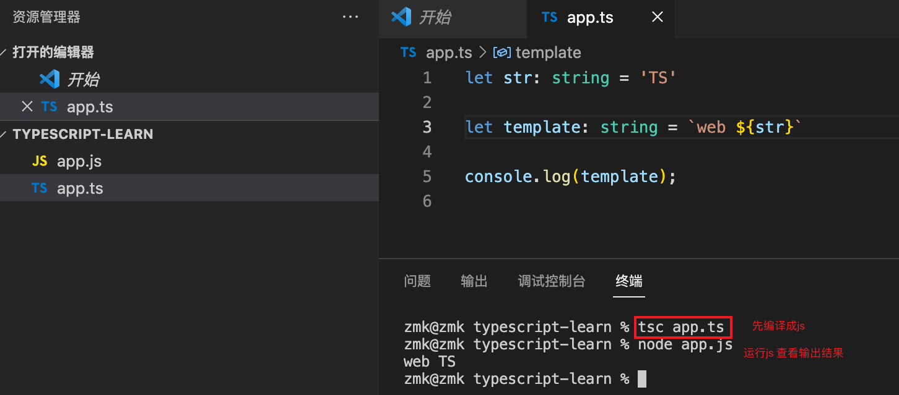
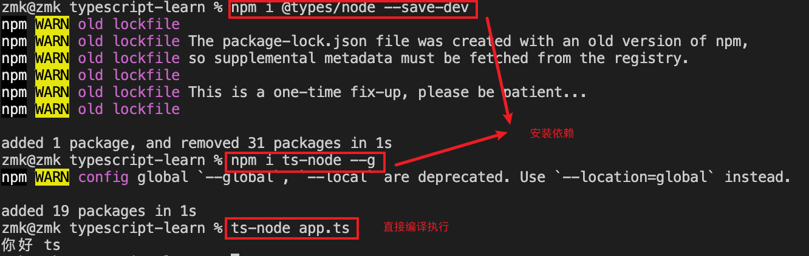

# TypeScript快速上手
PS：目前只记录了常见的常用的，更详细的点击👉[TypeScript🔗]((https://ts.xcatliu.com/introduction/index.html)
)进入学习

>TypeScript（JavaScript的超集）之所以叫做TypeScript，最大的感触当然就是Type上面了。也就是说TypeScript所带来的强类型。不过这里的强类型是静态的编译期间的强类型，而不是运行时的强类型。也就是说VSCode等编辑器可以很好的在编译甚至编辑期间帮你指出你代码的相关问题，但是一旦运行起来，因为最终还是编译成JavaScript运行，所以最终并不能保证运行时的类型安全。

```shell
# 全局安装typescript
npm intall typescript -g

# 查看ts版本
tsc -v
```

## 一、基础
### 1. 基础类型
基础类型：`Boolean`、`Number`、`String`、`null`、`undefined` 以及 ES6 的  `Symbol` 和 ES10 的 `BigInt`。

> 1.字符串类型

字符串是使用string定义的
```ts
//普通声明
let a: string = '123'

//也可以使用es6的字符串模板
let str: string = `dddd${a}`

其中 ` 用来定义 ES6 中的模板字符串，${expr} 用来在模板字符串中嵌入表达式。
```


> 2.数字类型

支持十六进制、十进制、八进制和二进制；

```ts
let notANumber: number = NaN; //Nan
let num: number = 123; //普通数字
let infinityNumber: number = Infinity; //无穷大
let decimal: number = 6; //十进制
let hex: number = 0xf00d; //十六进制
let binary: number = 0b1010; //二进制
let octal: number = 0o744; //八进制
```

> 3.布尔类型

<strong style="color: red">⚠️注意，使用构造函数 Boolean 创造的对象不是布尔值</strong>
```ts
let createdBoolean: boolean = new Boolean(1)
//这样会报错 应为事实上 new Boolean() 返回的是一个 Boolean 对象 
``` 
事实上 new Boolean() 返回的是一个 Boolean 对象 需要改成
```ts
let createdBoolean: Boolean = new Boolean(1)
```
```ts
let booleand: boolean = true //可以直接使用布尔值
let booleand2: boolean = Boolean(1) //也可以通过函数返回布尔值
```

> 4.空值类型

JavaScript 没有空值（Void）的概念，在 TypeScript 中，可以用 void 表示没有任何返回值的函数
```ts
function voidFn(): void {
    console.log('test void')
}
```
void 类型的用法，主要是用在我们不希望调用者关心函数返回值的情况下，比如通常的异步回调函数

**void也可以定义undefined 和 null类型**
```ts
let u: void = undefined;
let n: void = null; 
```
<strong style="color: red">⚠️注意：如果你配置了tsconfig.json 开启了严格模式 这时编译器就会报错：不能将类型“null”分配给类型“void”</strong>
```json
{
  "compilerOptions": {
    "strict": false
  }
}
```
> 5.Null和undefined类型

```ts
let u: undefined = undefined; //定义undefined
let n: null = null; //定义null
```
<strong style="color: red">⚠️注意：与 void 的区别是，undefined 和 null 是所有类型的子类型。也就是说 undefined 类型的变量，可以赋值给 string 类型的变量</strong>

```ts
let test: void = undefined
let num2: string = "1"
num2 = test  // 这样写会报错 void类型不可以分给其他类型

let test: null = null
let num2: string = "1"
num2 = test // 这样是没问题的
 
let test: undefined = undefined
let num2: string = "1"
num2 = test //或者这样的
```

### 2. 任意类型
```shell
# nodejs 环境执行ts  不需要经过先经过 tsc xxx.ts编译/node xxx.js执行
#1.安装依赖
  npm i @types/node --save-dev
  npm i ts-node --g
#2.直接编译运行
  ts-node xxx.ts
```


> 1.Any 类型 和 unknown 顶级类型

1.没有强制限定哪种类型，随时切换类型都可以 我们可以对 any 进行任何操作，不需要检查类型
```ts
let anys: any = 123
anys = '123'
anys = true
```

2.声明变量的时候没有指定任意类型默认为any
```ts
let anys;
console.log(anys, typeof anys); // undefined undefined

anys = 18;
console.log(anys); // 18

anys = 'nihao'
console.log(anys); // any
```

3.**弊端如果使用any 就失去了TS类型检测的作用**

4.TypeScript 3.0中引入的 unknown 类型也被认为是 top type ，但它更安全。与 any 一样，所有类型都可以分配给unknown

unknow  unknow类型比any更加严格当你要使用any 的时候可以尝试使用unknow
```ts
//unknown 可以定义任何类型的值
let value: unknown;
 
value = true;             // OK
value = 42;               // OK
value = "Hello World";    // OK
value = [];               // OK
value = {};               // OK
value = null;             // OK
value = undefined;        // OK
value = Symbol("type");   // OK
 
//unknow类型不能作为子类型只能作为父类型
let names:unknown = '123'
let names2:string = names // 报错
 
//any类型既可以作为父类型也子类型
let names:any = '123'
let names2:string = names   
 
//unknown可赋值对象只有unknown 和 any
let bbb:unknown = '123'
let aaa:any= '456'
aaa = bbb
```
any 和 unkown的区别
```ts
//如果是any类型在对象没有这个属性的时候还在获取是不会报错的
let obj:any = {b:1}
obj.a
 
// 如果是unknow是不能调用属性和方法
let obj:unknown = {b:1,ccc:():number=>213}
obj.b // 报错
obj.ccc() // 报错
```

### 3. 接口和对象类型
#### 加餐
object、Object 以及{} 这三个类型大家可能不太理解

> 1.object

object 代表所有非值类型的类型，例如 数组 对象 函数等，常用于泛型约束
```ts
let o:object = {}//正确
let o1:object = []//正确 
let o2:object = ()=>123 //正确

let b:object = '123' //错误
let c:object = 123 //错误
```

> 2.Object

Object类型是所有Object类的实例的类型。 由以下两个接口来定义：
  - Object 接口定义了 Object.prototype 原型对象上的属性；
  - ObjectConstructor 接口定义了 Object 类的属性， 如上面提到的 Object.create()

这个类型是跟`原型链`有关的原型链顶层就是Object，所以值类型和引用类型最终都指向**Object，所以他包含所有类型。**
```ts
let o: Object = 1 // 正确
let o2: Object = '123' // 正确
let o3: Object = ['111'] // 正确
let o4: Object = new Object() // 正确
let o5: Object = {} // 正确
let o6: Object = () => { 111 } // 正确
```

> 3.{}

看起来很别扭的一个东西 你可以把他理解成new Object，就和我们的第一个Object基本一样 包含所有类型
```ts
// 字面量模式是不能修改值的 (少用)
let a1: {} = {name:1} //正确
let a2: {} =  () => 123 //正确
let a3: {} = 123 //正确
```

#### 正文
> 1.对象的类型

在typescript中，我们定义对象的方式要用关键字`interface`（接口），我的理解是使用interface来定义一种约束，让数据的结构满足约束的格式。定义方式如下：
```ts
//这样写是会报错的 因为我们在person定义了a，b但是对象里面缺少b属性
//使用接口约束的时候不能多一个属性也不能少一个属性
//必须与接口保持一致
interface Person {
    b: string,
    a: string
}
```

```ts
const person:Person  = {
    a: "213"
}
// or
const person = {
    a: "213"
} as Person 

//重名interface  可以合并
interface A {name:string}
interface A {age:number}
var x: A = {name:'xx',age:20}
//继承
interface A{
  name: string
}
 
interface B extends A{
  age: number
}
 
let obj: B = {
  age: 18,
  name: "string"
}
```

> 2.可选属性 使用`?`操作符

```ts
interface Person {
    b?:string, // 可选属性的含义是该属性可以不存在
    a:string
}
 
const person:Person  = {
    a:"213"
}
```

> 3.任意属性 [propName: string]

<strong style="color: red">⚠️注意：一旦定义了任意属性，那么确定属性和可选属性的类型都必须是它的类型的子集</strong>
```ts
//在这个例子当中我们看到接口中并没有定义C但是并没有报错
//应为我们定义了[propName: string]: any;
//允许添加新的任意属性
interface Person {
    b?:string,
    a:string,
    [propName: string]: any; // 任意属性
}
 
const person:Person  = {
    a:"213",
    c:"123" // 任意属性
}
```

> 4.只读属性 readonly

readonly 只读属性是不允许被赋值的只能读取
```ts
//这样写是会报错的
//应为a是只读的不允许重新赋值
interface Person {
    b?: string, // 可选属性
    readonly a: string,
    [propName: string]: any; // 任意属性
}
 
const person: Person = {
    a: "213",
    c: "123"
}
 
person.a = 123
```

> 5.添加函数

```ts
interface Person {
    b?: string, // 可选属性
    readonly a: string, // 只读属性
    [propName: string]: any; // 任意属性
    cb():void // 函数
}
 
const person: Person = {
    a: "213",
    c: "123",
    cb:()=>{
        console.log(123)
    }
}
```

### 4. 数组类型
>  1. 普通方式 声明数组类型

规则：类型[ ] 
```ts
//类型加中括号 
let arr:number[] = [123]
//这样会报错定义了数字类型出现字符串是不允许的
let arr:number[] = [1,2,3,'1']
//操作方法添加也是不允许的
let arr:number[] = [1,2,3,]
arr.unshift('1') // 报错
 
var arr: number[] = [1, 2, 3]; //数字类型的数组
var arr2: string[] = ["1", "2"]; //字符串类型的数组
var arr3: any[] = [1, "2", true]; //任意类型的数组
```

> 2. 数组范型 声明

规则：Array<类型>
```ts
let arr:Array<number> = [1,2,3,4,5]
```

> 3. 多维数组

```ts
let data:number[][] = [[1,2], [3,4]];
```

> 4. 用接口表示数组

一般用来描述类数组
```ts
interface NumberArray {
    [index: number]: number;
}
let fibonacci: NumberArray = [1, 1, 2, 3, 5];
//表示：只要索引的类型是数字时，那么值的类型必须是数字
```

> 5. any 在数组中的应用

一个常见的例子数组中可以存在任意类型
```ts
let list: any[] = ['test', 1, [],{a:1}]
```

### 5. 函数扩展
> 1. 函数的类型

```ts
//注意，参数不能多传，也不能少传 必须按照约定的类型来
const fn = (name: string, age:number): string => {
    return name + age
}
fn('张三',18) // return 张三18

```
> 2. 函数的可选参数

```ts
//通过?表示该参数为可选参数
const fn = (name: string, age?:number): string => {
    return name + age
} 
fn('张三') // return 张三
```
> 3. 函数参数的默认值

```ts
const fn = (name: string = "我是默认值"): string => {
    return name
}
fn() // return 我是默认值
```
> 4. 接口定义函数

```ts
interface User{
    name: string;
    age: number;
}
function getUserInfo(user: User): User {
  return user
}

let p = getUserInfo({
  name: 'zhangsan',
  age: 18
})

console.log(p) // { name: 'zhangsan', age: 18 }
```

> 5. 函数重载

重载是方法名字相同，而参数不同，返回类型可以相同也可以不同
如果参数类型不同，则参数类型应设置为 any
参数数量不同你可以将不同的参数设置为可选
```ts
function fn(params: number): void
 
function fn(params: string, params2: number): void
 
function fn(params: any, params2?: any): void {
  console.log(params)
  console.log(params2)
}
 
fn(123)
fn('123',456)
```

### 6. 类型断言 | 联合类型 | 交叉类型
> 1. 联合类型 |

变量使用联合类型 
```ts
//例如我们的手机号通常是13XXXXXXX 为数字类型 这时候产品说需要支持座机
//所以我们就可以使用联合类型支持座机字符串
let myPhone: number | string  = '010-820'
 
//这样写是会报错的应为我们的联合类型只有数字和字符串并没有布尔值
let myPhone: number | string  = true
```
函数使用联合类型
```ts
const fn = (something:number | boolean):boolean => {
  return !something // !! 强转位boolean类型
}
```

> 2. 交叉类型 &

多种类型的集合，联合对象将具有所联合类型的所有成员
```ts
interface People {
  age: number,
  height： number
}

interface Man{
  sex: string
}

const xiaoman = (man: People & Man) => {
  console.log(man.age)
  console.log(man.height)
  console.log(man.sex)
}

xiaoman({age: 18,height: 180,sex: 'male'});
```

> 3. 类型断言

语法：`值 as 类型`
```ts
let fn = (num: number | string): void => {
  console.log((num as string).length);
}
fn(111) // undefined
fn('111') // 3


interface A {
  name: string
}
interface B {
  age: number
}
let fn = (type: A | B): void => {
  console.log((type as A).name);
}
fn({
  name: 'li'
})  // li
```
<strong style="color: red">⚠️注意：类型断言只能够「欺骗」TypeScript 编译器，无法避免运行时的错误，反而滥用类型断言可能会导致运行时错误</strong>

```ts
interface Cat {
    name: string;
    run(): void;
}
interface Fish {
    name: string;
    swim(): void;
}

function swim(animal: Cat | Fish) {
    (animal as Fish).swim();
}

const tom: Cat = {
    name: 'Tom',
    run() { console.log('run') }
};
swim(tom);
// Uncaught TypeError: animal.swim is not a function`
```

### 7. [内置对象](https://ts.xcatliu.com/basics/built-in-objects.html)

## 二、进阶
### 1. [Class类](https://ts.xcatliu.com/advanced/class.html)

### 2. 元组
数组合并了相同类型的对象，而元组（Tuple）合并了不同类型的对象。
举个简单的例子，定义一对值分别为 string 和 number 的元组。

```ts
let tom: [string, number] = ['Tom', 25];
```

当赋值或访问一个已知索引的元素时，会得到正确的类型：

```ts
let tom: [string, number];
tom[0] = 'Tom';
tom[1] = 25;

tom[0].slice(1);
tom[1].toFixed(2);
```

也可以只赋值其中一项：
```ts
let tom: [string, number];
tom[0] = 'Tom';
```
但是当直接对元组类型的变量进行初始化或者赋值的时候，需要提供所有元组类型中指定的项。
```ts
let tom: [string, number];
tom = ['Tom', 25];
let tom: [string, number];
tom = ['Tom'];

// Property '1' is missing in type '[string]' but required in type '[string, number]'.
```
越界的元素
当添加越界的元素时，它的类型会被限制为元组中每个类型的联合类型：
```ts
let tom: [string, number];
tom = ['Tom', 25];
tom.push('male');
tom.push(true);

// Argument of type 'true' is not assignable to parameter of type 'string | number'.
```

### 3. 枚举类型
在JS中是没有枚举的概念，TS帮我们定义了枚举这个类型 
通过`enum`关键字定义我们的枚举

> 1. 数字枚举

例如：红绿蓝 Red = 0 Green = 1 Blue= 2 分别代表红色0 绿色为1 蓝色为2
```ts
enum Types {
  Red, // 0
  Green, // 1
  BLue // 2
}

console.log(Types.Green); // 1
//默认就是从0开始的 可以不写值
```
增长枚举
```ts
enum Types{
   Red = 1,
   Green, // 2
   BLue // 3
}
//如上，我们定义了一个数字枚举，Red使用初始化为1。其余的成员会从1开始自动增长。
```

> 2. 字符串枚举

字符串枚举的概念很简单。 在一个字符串枚举里，每个成员都必须用字符串字面量，或另外一个字符串枚举成员进行初始化。

```ts
enum Types{
   Red = 'red',
   Green = 'green',
   BLue = 'blue'
}
```
由于字符串枚举没有自增长的行为，字符串枚举可以很好的序列化。 换句话说，如果你正在调试并且必须要读一个数字枚举的运行时的值，这个值通常是很难读的 - 它并不能表达有用的信息，字符串枚举允许你提供一个运行时有意义的并且可读的值，独立于枚举成员的名字。

> 3. 异构枚举

```ts
enum Types{
   No = "No",
   Yes = 1,
}
// 不推荐
```

### 4. 类型别名
类型别名用来给一个类型起个新名字。关键字 `type` 创建类型别名
```ts
// 定义类型别名
type Name = string;

// 定义函数别名
type NameResolver = () => string;

type NameOrResolver = Name | NameResolver;

function getName(n: NameOrResolver): Name {
    if (typeof n === 'string') {
        return n;
    } else {
        return n();
    }
}
```

### 5. [泛型](https://ts.xcatliu.com/advanced/generics.html)
`泛型`在TypeScript是很重要的东西，例如vue3是用ts编写的，里面用到了非常多的泛型

> 1. 函数泛型

以下两个函数一个是数字类型的函数，另一个是字符串类型的函数
```ts
function num (a:number,b:number) : Array<number> {
    return [a ,b];
}
num(1,2)
function str (a:string,b:string) : Array<string> {
    return [a ,b];
}
str('独孤','求败')
```
可以发现上述两个函数其实就是类型不同，实现的功能是一样的，这时候我们就可以使用泛型来优化。
格式：`函数名字后面跟一个<参数名>` 参数名可以随便写 例如`add<T>`
```ts
// 泛型
function add<T>(a: T, b: T): Array<T> {
  return [a, b]
}

// string类型
add<string>('1', '2')

add('1', '2') // 简化 类型推断

// number类型
add<number>(1, 2)

add(1, 2) // 简化
```
我们也可以使用不同的泛型参数名，只要在数量上和使用方式上能对应上就可以
```ts
function sub<T, U>(a: T, b: U): Array<T | U> {
  const params: Array<T | U> = [a, b]
  return params
}

sub<boolean, number>(false, 1)

sub(true, 2)
```
> 2. 泛型约束
在函数内部使用泛型变量的时候，由于事先不知道它是哪种类型，所以不能随意的操作它的属性或方法：
```ts
function loggingIdentity<T>(arg: T): T {
    console.log(arg.length);
    return arg;
}

// index.ts(2,19): error TS2339: Property 'length' does not exist on type 'T'.
```
上例中，泛型 T 不一定包含属性 length，所以编译的时候报错了。
这时，我们可以对泛型进行约束，只允许这个函数传入那些包含 length 属性的变量。这就是泛型约束：
```ts
interface Lengthwise {
    length: number;
}

function loggingIdentity<T extends Lengthwise>(arg: T): T {
    console.log(arg.length);
    return arg;
}

loggingIdentity(7); // 编译阶段就报错
loggingIdentity('122'); // 3 ok
```
上例中，我们使用了 extends 约束了泛型 T 必须符合接口 Lengthwise 的形状，也就是必须包含 length 属性。
此时如果调用 loggingIdentity 的时候，传入的 arg 不包含 length，那么在编译阶段就会报错了


## 二、TS配置、应用相关
### 1. tsconfig.json配置文件
通过`tsc --init`命令可生成tsconfig.json文件
```json
{
  "compilerOptions": {
    "incremental": true, // TS编译器在第一次编译之后会生成一个存储编译信息的文件，第二次编译会在第一次的基础上进行增量编译，可以提高编译的速度
    "tsBuildInfoFile": "./buildFile", // 增量编译文件的存储位置
    "diagnostics": true, // 打印诊断信息 
    "target": "ES5", // 目标语言的版本
    "module": "CommonJS", // 生成代码的模板标准
    "outFile": "./app.js", // 将多个相互依赖的文件生成一个文件，可以用在AMD模块中，即开启时应设置"module": "AMD",
    "lib": ["DOM", "ES2015", "ScriptHost", "ES2019.Array"], // TS需要引用的库，即声明文件，es5 默认引用dom、es5、scripthost,如需要使用es的高级版本特性，通常都需要配置，如es8的数组新特性需要引入"ES2019.Array",
    "allowJS": true, // 允许编译器编译JS，JSX文件
    "checkJs": true, // 允许在JS文件中报错，通常与allowJS一起使用
    "outDir": "./dist", // 指定输出目录
    "rootDir": "./", // 指定输出文件目录(用于输出)，用于控制输出目录结构
    "declaration": true, // 生成声明文件，开启后会自动生成声明文件
    "declarationDir": "./file", // 指定生成声明文件存放目录
    "emitDeclarationOnly": true, // 只生成声明文件，而不会生成js文件
    "sourceMap": true, // 生成目标文件的sourceMap文件
    "inlineSourceMap": true, // 生成目标文件的inline SourceMap，inline SourceMap会包含在生成的js文件中
    "declarationMap": true, // 为声明文件生成sourceMap
    "typeRoots": [], // 声明文件目录，默认时node_modules/@types
    "types": [], // 加载的声明文件包
    "removeComments":true, // 删除注释 
    "noEmit": true, // 不输出文件,即编译后不会生成任何js文件
    "noEmitOnError": true, // 发送错误时不输出任何文件
    "noEmitHelpers": true, // 不生成helper函数，减小体积，需要额外安装，常配合importHelpers一起使用
    "importHelpers": true, // 通过tslib引入helper函数，文件必须是模块
    "downlevelIteration": true, // 降级遍历器实现，如果目标源是es3/5，那么遍历器会有降级的实现
    "strict": true, // 开启所有严格的类型检查
    "alwaysStrict": true, // 在代码中注入'use strict'
    "noImplicitAny": true, // 不允许隐式的any类型
    "strictNullChecks": true, // 不允许把null、undefined赋值给其他类型的变量
    "strictFunctionTypes": true, // 不允许函数参数双向协变
    "strictPropertyInitialization": true, // 类的实例属性必须初始化
    "strictBindCallApply": true, // 严格的bind/call/apply检查
    "noImplicitThis": true, // 不允许this有隐式的any类型
    "noUnusedLocals": true, // 检查只声明、未使用的局部变量(只提示不报错)
    "noUnusedParameters": true, // 检查未使用的函数参数(只提示不报错)
    "noFallthroughCasesInSwitch": true, // 防止switch语句贯穿(即如果没有break语句后面不会执行)
    "noImplicitReturns": true, //每个分支都会有返回值
    "esModuleInterop": true, // 允许export=导出，由import from 导入
    "allowUmdGlobalAccess": true, // 允许在模块中全局变量的方式访问umd模块
    "moduleResolution": "node", // 模块解析策略，ts默认用node的解析策略，即相对的方式导入
    "baseUrl": "./", // 解析非相对模块的基地址，默认是当前目录
    "paths": { // 路径映射，相对于baseUrl
      // 如使用jq时不想使用默认版本，而需要手动指定版本，可进行如下配置
      "jquery": ["node_modules/jquery/dist/jquery.min.js"]
    },
    "rootDirs": ["src","out"], // 将多个目录放在一个虚拟目录下，用于运行时，即编译后引入文件的位置可能发生变化，这也设置可以虚拟src和out在同一个目录下，不用再去改变路径也不会报错
    "listEmittedFiles": true, // 打印输出文件
    "listFiles": true// 打印编译的文件(包括引用的声明文件)
  }
  
  // 指定一个匹配列表（属于自动指定该路径下的所有ts相关文件）
  "include": [
    "src/**/*"
  ],
  // 指定一个排除列表（include的反向操作）
  "exclude": [
    "demo.ts"
  ],
  // 指定哪些文件使用该配置（属于手动一个个指定文件）
  "files": [
    "demo.ts"
  ]
}
``` 
介绍几个常用的：
1. include  指定编译文件，默认是编译当前目录下所有的ts文件
2. exclude  指定排除的文件
3. target 指定编译js的版本 例如es5  es6
4. allowJS  是否允许编译js文件
5. removeComments 是否在编译过程中删除文件中的注释
6. rootDir  编译文件的目录
7. outDir 输出的目录
8. sourceMap  代码源文件
9. strict 严格模式
10. module  默认common.js 可选es6模式 amd umd等

### 2. [声明文件d.ts](https://ts.xcatliu.com/basics/declaration-files.html)

### 3. [Rollup构建TS项目 & webpack构建TS项目](https://xiaoman.blog.csdn.net/article/details/122708348)
