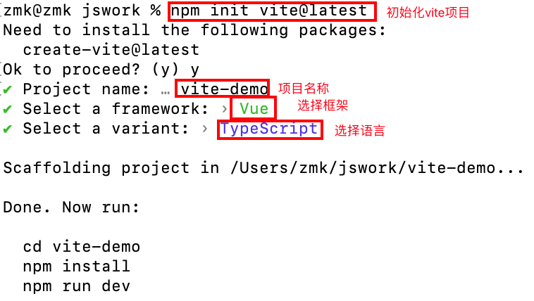

## [Vite](https://cn.vitejs.dev/guide/)

### 总览
Vite（法语意为 "快速的"，发音 /vit/，发音同 "veet"）是一种新型前端构建工具，能够显著提升前端开发体验。它主要由两部分组成：

- 一个开发服务器，它基于 原生 ES 模块 提供了 丰富的内建功能，如速度快到惊人的 模块热更新（HMR）。

- 一套构建指令，它使用 Rollup 打包你的代码，并且它是预配置的，可输出用于生产环境的高度优化过的静态资源。

Vite 意在提供开箱即用的配置，同时它的 插件 API 和 JavaScript API 带来了高度的可扩展性，并有完整的类型支持。

> ⚠️兼容性注意：
Vite 需要 Node.js 版本 14.18+，16+。然而，有些模板需要依赖更高的 Node 版本才能正常运行，当你的包管理器发出警告时，请注意升级你的 Node 版本。

### 配置环境
1. 构建vue3 vite构建（简洁）：`npm init vite@latest`
示例：

2. 构建vue3 vue-cli脚手架构建（专门为vue项目构建、全一点）：`npm init vue@latest`
示例：

### SFC 语法规范
*.vue 件都由三种类型的顶层语法块所组成：`<template>`、`<script>`、`<style>`

**`<template>`**
- 每个 *.vue 文件最多可同时包含一个顶层 `<template>` 块
- 其中的内容会被提取出来并传递给 @vue/compiler-dom，预编译为 JavaScript 的渲染函数，并附属到导出的组件上作为其 render 选项

**`<script>`**
- 每一个 *.vue 文件可以有多个 `<script>` 块 (不包括`<script setup>`)
- 该脚本将作为 ES Module 来执行
- 其默认导出的内容应该是 Vue 组件选项对象，它要么是一个普通的对象，要么是 defineComponent 的返回值

**`<script setup>`**
- 每个 *.vue 文件最多只能有一个 `<script setup>` 块 (不包括常规的 `<script>`)
- 该脚本会被预处理并作为组件的 setup() 函数使用，也就是说它会在每个组件实例中执行。`<script setup>` 的顶层绑定会自动暴露给模板。更多详情请查看 `<script setup>` 文档

**`<style>`**
- 一个 *.vue 文件可以包含多个 `<style>` 标签。
- `<style>` 标签可以通过 scoped 或 module attribute (更多详情请查看 SFC 样式特性) 将样式封装在当前组件内。多个不同封装模式的 `<style>` 标签可以在同一个组件中混